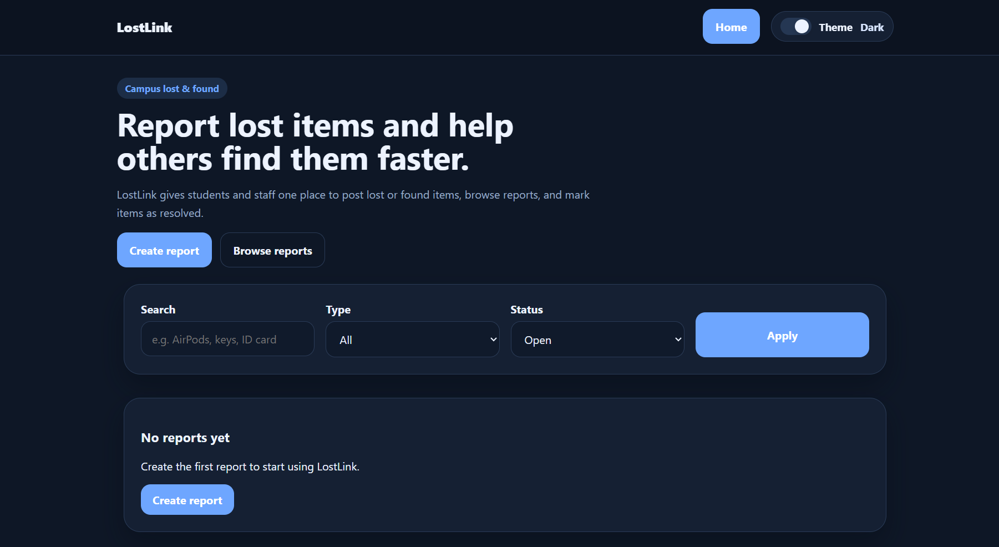
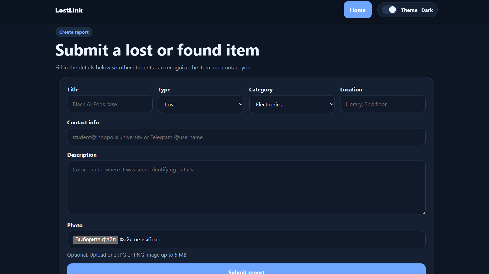

# LostLink

A campus lost-and-found web app for reporting and finding missing items.

## Demo




## Product Context

### End Users

- Students
- University staff

### Problem That the Product Solves for End Users

People often lose items such as keys, ID cards, chargers, headphones, or bottles on campus, but there is usually no single place where they can report them or check what has already been found.

### Our Solution

LostLink provides one website where users can post lost or found item reports, browse existing reports, open a detailed page for each item, and mark a case as resolved when the item is returned.

## Features

### Implemented Features

- Web interface for creating and browsing lost/found reports
- FastAPI backend with server-rendered pages
- PostgreSQL support for Docker deployment
- SQLite support for local development
- Create a lost or found item report
- Upload one optional photo for an item report
- Browse all reports on the home page
- Filter reports by item type and status
- Search reports by title or description
- Open an item details page
- Mark an item as resolved
- Light/dark theme toggle
- Health check endpoint at `/health`
- API documentation via `/docs`

### Not Yet Implemented

- User authentication
- Multiple photos per item
- Notifications by email or push
- Admin moderation dashboard
- Pagination for large numbers of reports
- Editing existing reports after creation

## Usage

1. Open the web app in a browser.
2. Click **Create report**.
3. Fill in the title, type, category, location, contact info, and description.
4. Optionally attach a JPG or PNG photo of the item.
5. Submit the form.
6. Browse reports on the home page.
7. Use search and filters to find matching reports.
8. Open an item details page to view the full information and photo.
9. Mark the report as resolved once the item is returned.

## Deployment

### VM OS

Ubuntu 24.04

### What Should Be Installed on the VM

- Git
- Docker Engine
- Docker Compose plugin

### Step-by-Step Deployment Instructions

1. Clone the repository:

   ```bash
   git clone <YOUR_GITHUB_REPO_URL> lostlink
   cd lostlink
   ```

2. Create an environment file:

   ```bash
   cp .env.example .env
   ```

3. Build and start the containers:

   ```bash
   docker compose up --build -d
   ```

4. Check that the services are running:

   ```bash
   docker compose ps
   ```

5. Open the application in a browser:

   - App: `http://<VM_IP>:8000`
   - API docs: `http://<VM_IP>:8000/docs`

6. If needed, inspect logs:

   ```bash
   docker compose logs -f
   ```

7. Stop the deployment:

   ```bash
   docker compose down
   ```
