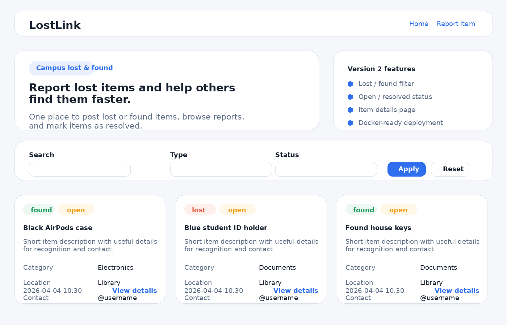
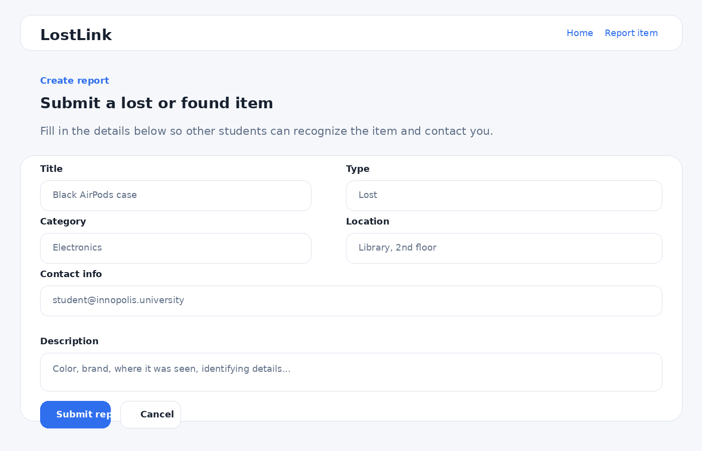

# LostLink

A simple campus lost-and-found web app.

## Demo

Screenshots:




## Product context

### End users
- Students
- University staff

### Problem that the product solves for end users
People often lose items such as keys, ID cards, chargers, headphones, or water bottles on campus, but there is usually no centralized place to report them or browse what has already been found.

### Solution
LostLink provides one website where users can submit lost or found item reports, browse all reports, filter them, open a details page, and mark an item as resolved.

## Features

### Implemented features
- Web frontend for end users
- FastAPI backend with server-rendered pages and JSON API
- PostgreSQL database support
- Create a lost/found item report
- Browse all reports on the home page
- Filter reports by type and status
- Search reports by title or description
- Open an item details page
- Mark an item as resolved
- Dockerfile and Docker Compose for deployment
- Health check endpoint: `/health`
- API docs via FastAPI: `/docs`

### Not yet implemented
- User authentication
- Image uploads for item reports
- Email or push notifications
- Admin moderation dashboard
- Pagination for very large report lists

## Usage

### How to use the product
1. Open the web app in a browser.
2. Click **Report item**.
3. Fill in the form with title, type, category, location, contact, and description.
4. Submit the report.
5. Browse reports on the home page.
6. Use filters to view only lost/found or open/resolved reports.
7. Open an item details page and mark it as resolved when the item is returned.

### API endpoints
- `GET /api/items` — list all items
- `POST /api/items` — create a new item
- `GET /api/items/{id}` — get one item
- `PATCH /api/items/{id}/resolve` — mark an item as resolved

## Version plan

### Version 1
- Submit a lost/found report through a web form
- Save the report to the database
- Display reports on the home page

### Version 2
- Filters by type and status
- Search support
- Item details page
- Mark item as resolved
- Improved UI and Dockerized deployment

## Deployment

### VM OS
Ubuntu 24.04

### What should be installed on the VM
- Git
- Docker Engine
- Docker Compose plugin

### Step-by-step deployment instructions
1. Clone the repository:
   ```bash
   git clone <YOUR_GITHUB_REPO_URL> se-toolkit-hackathon
   cd se-toolkit-hackathon
   ```
2. Copy the environment file:
   ```bash
   cp .env.example .env
   ```
3. Start the services:
   ```bash
   docker compose up --build -d
   ```
4. Open the product in the browser:
   - App: `http://<VM_IP>:8000`
   - Swagger docs: `http://<VM_IP>:8000/docs`
5. Check container status:
   ```bash
   docker compose ps
   ```
6. View logs if needed:
   ```bash
   docker compose logs -f
   ```
7. Stop the project:
   ```bash
   docker compose down
   ```

### Local run without Docker
1. Create a virtual environment and activate it.
2. Install dependencies:
   ```bash
   pip install -r requirements.txt
   ```
3. Start the app:
   ```bash
   uvicorn app.main:app --reload
   ```
4. Open `http://127.0.0.1:8000`

### Optional seed data
To populate the local database with a couple of demo items:
```bash
python -m app.seed
```
